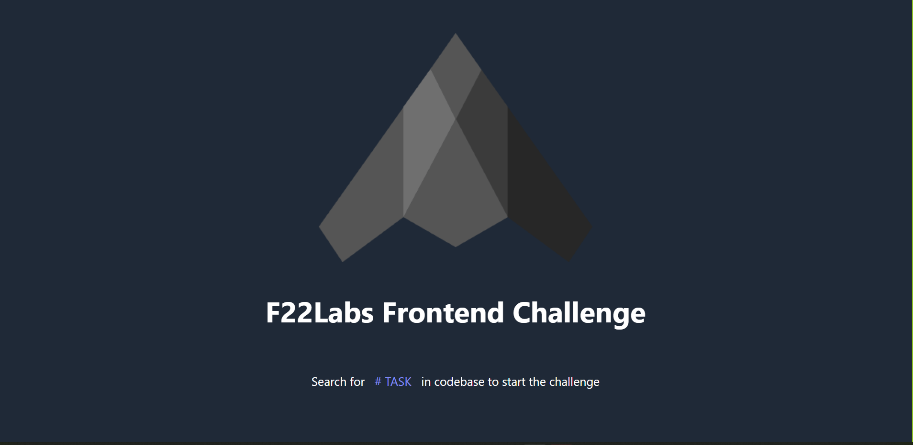

# F22Lab Front-end Challenge

> F22Lab Front-end Challenge is a project from F22Lab to achieve the given tasks .

## Screenshots:

### Landing Page



### Singup Page


### Home Page


## Built With

- HTML
- CSS
- Tailwind
- JavaScript
- REACT
- Craco
- Jest

## Online live link

[Visit project online](https://f22-challenge-thecodechaser.netlify.app)

## Getting Started

To get a local copy up and running follow these simple example steps.

### Prerequisites
- A text editor(preferably Visual Studio Code)
- Node
- Web browser

### Install
- [Git](https://git-scm.com/downloads)
- [Node](https://nodejs.org/en/download/)

### Using it Locally

- Clone the project

```bash 
git clone https://github.com/thecodechaser/f22Lab-frontend-Challaenge

cd f22Lab-frontend-Challaenge
```

- Install dependencies

```bash
npm i 
or
npm install
```
- To Start the development server
```bash
npm start
```


## Visit And Open Files

[Visit Repo](https://github.com/thecodechaser/f22Lab-frontend-Challaenge)

## Download Repo

[Download Repo](https://github.com/thecodechaser/f22Lab-frontend-Challaenge/archive/refs/heads/main.zip)

## Authors

👤 **F22Lab**

- Website [F22Lab](https://www.f22labs.com)

👤 **Ranjeet Singh**

- GitHub: [@githubhandle](https://github.com/thecodechaser)
- Twitter: [@twitterhandle](https://twitter.com/thecodechaser)
- LinkedIn: [LinkedIn](https://linkedin.com/in/thecodechaser)


## 🤝 Contributing

Contributions, issues, and feature requests are welcome!

Feel free to check the [issues page](https://github.com/thecodechaser/f22Lab-frontend-Challaenge/issues).

## Show your support

Give a ⭐️ if you like this project!

## Acknowledgments

- Inspiration: F22Lab 

## 📝 License

This project is [MIT](./MIT.md) licensed.
